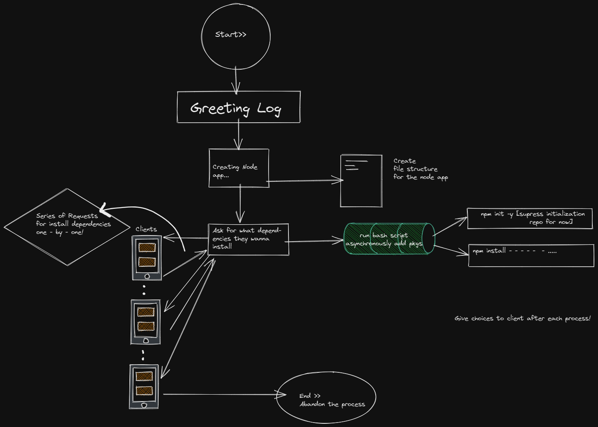

<h1 align="center" id="title">Nodeforce Command Line Interface</h1>

<p align="center"></p>


<p id="description">NodeForce CLI is a powerful command-line tool designed to significantly reduce the time required to set up Node.js applications. It automates the creation of folder structures generates useful code files and installs dependencies enabling developers to kickstart their projects effortlessly</p>



  
  
<h2>🧐 Features</h2>

Here're some of the project's best features:

*   Folder Structure Generation: NodeForce CLI creates a well-organized folder structure for your Node.js application saving you from the hassle of setting it up manually. The predefined structure includes directories for API database documentation routes and views.
*   Code File Generation: It generates boilerplate code files within the appropriate directories preconfigured to help you get started quickly. This includes sample API endpoints database scripts route handlers and views templates.
*   Dependency Installation: NodeForce CLI simplifies the installation of common dependencies used in Node.js applications. It provides a streamlined approach to specify the required packages and automatically installs them with a single command.

<h2>🛠️ Installation Steps:</h2>

<p>1. Install Nodeforce's Dependencies via running this in your Terminal</p>

```
npm i 
```

<p>2. Run nodeforce :</p>

```
node Nodeforce
```

<h2>🍰 Contribution Guidelines:</h2>

Contributions are welcome from the community to enhance NodeForce CLI. If you encounter any issues or have suggestions for new features please feel free to open an issue or submit a pull request.

  
  
<h2>💻 Built with</h2>

Technologies used in the project:

*   Javascript
*   Node.js
*   Express.js
*   Zsh
*   Shell Scripting

<h2>🛡️ License:</h2>

This project is licensed under the GNU General Public License v3.0


> ### Note : THE TOOL IS IN THE PROCESS OF DEVELOPMENT AND IS CURRENTLY BEING STAGED FOR NPM PACKAGE.PLEASE RUN THE CLI LOCALLY FOR NOW